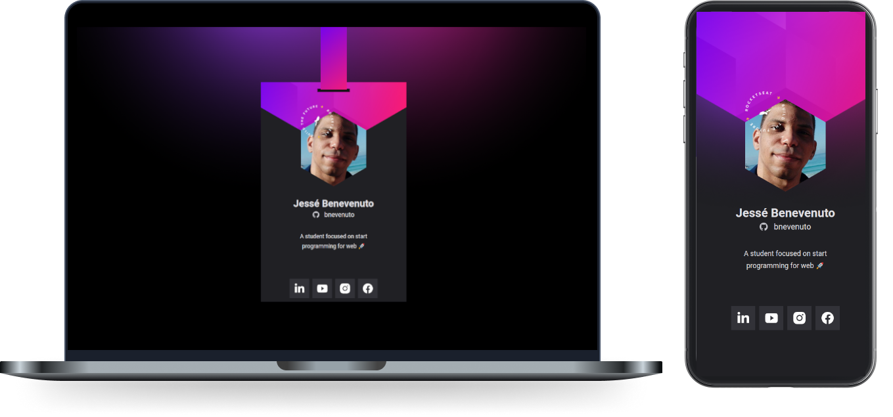

<h1 align="center">
  Bagde DoWhile 2021 2.0
</h1>

  <a href="#-tecnologias">Tecnologias</a>&nbsp;&nbsp;&nbsp;|&nbsp;&nbsp;&nbsp;
  <a href="#-projeto">Projeto</a>&nbsp;&nbsp;&nbsp;|&nbsp;&nbsp;&nbsp;
  <a href="#-layout">Layout</a>&nbsp;&nbsp;&nbsp;|&nbsp;&nbsp;&nbsp;
  <a href="#memo-licença">Licença</a>

  

 

  

Github Pages https://bnevenuto.github.io/badge-doWhile2021-2.0/

## 🚀 Tecnologias

Esse projeto foi desenvolvido com as seguintes tecnologias:

- HTML
- CSS
- JavaScript

## 💻 Projeto

O Bagde DoWhile 2021 é uma aplicação estática com o objetivo de mostrar as informações do usuário trazidas do GitHub API e inseri-lás em um layout com a cara do evento DoWhile 2021.

## 🔖 Layout

Nos links abaixo você encontra o layout do projeto [desse link](<https://www.figma.com/file/9Z2vxc8VTRuZpYjFalCMAl/Badge-Do-While2021-(Copy)?node-id=0%3A1>). Lembrando que você precisa ter uma conta no [Figma](https://figma.com) para acessá-lo.

## 🧠 Desafio

Desafios propostos para que você possa percorrer a milha extra e incrementar ainda mais essa aplicação. 

- ✔️ Versão Desktop
- ✔️ Mudar cores (Figma)
- ✔️ Animação

## :memo: Licença

Esse projeto está sob a licença MIT. Veja o arquivo [LICENSE](.github/LICENSE.md) para mais detalhes.

---

Atualizado com ♥ by Jessé Benevenuto :wave: [Participe da nossa comunidade Rocketseat!](https://discordapp.com/invite/gCRAFhc)
